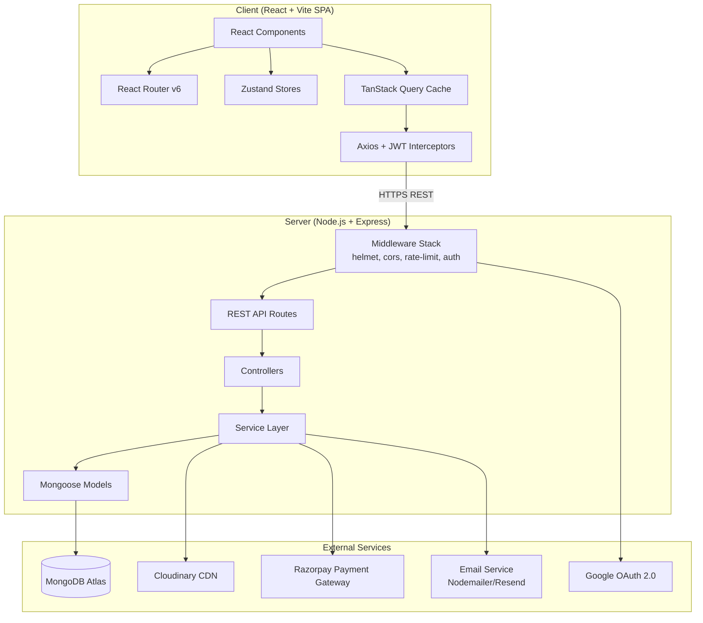
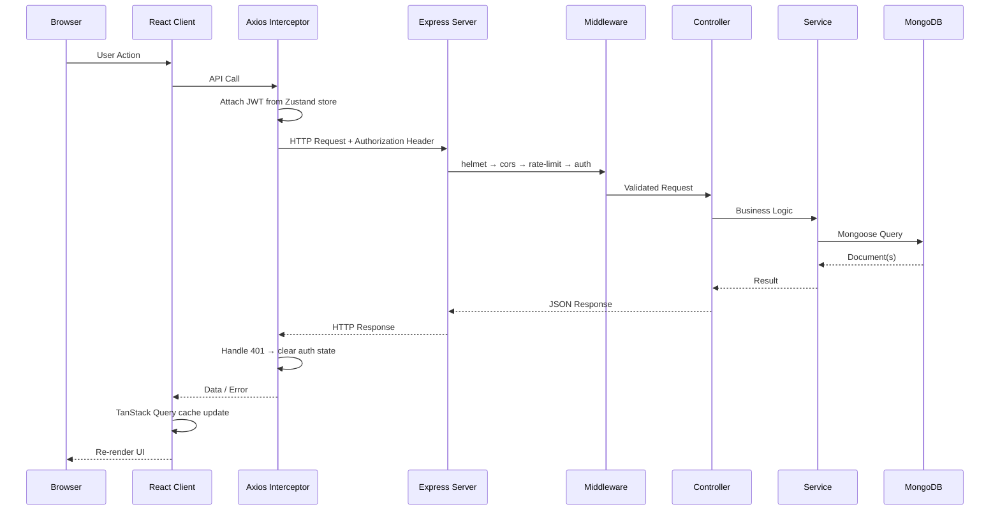
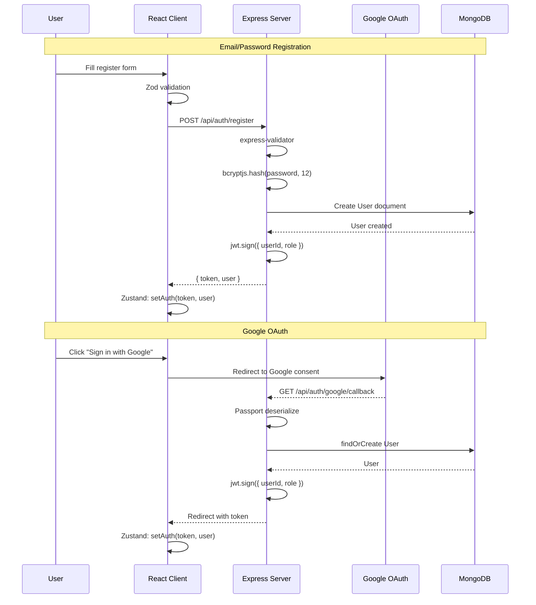
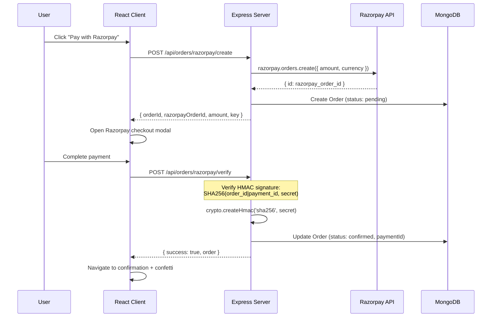
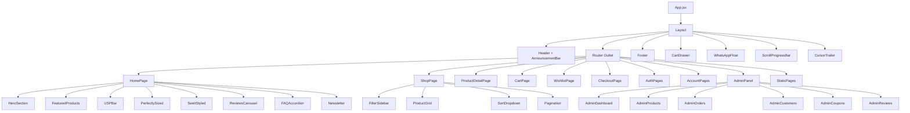

# Design Document: Zimor India Ecommerce Platform

## Overview

Zimor India is a full-stack ecommerce web application for a women's premium workbag brand based in Varanasi, UP. The platform delivers a visually stunning, conversion-optimized shopping experience with a React SPA frontend and a Node.js/Express REST API backend.

The system is split into two independently deployable applications: a `/client` React + Vite SPA handling all user-facing UI, routing, state management, and micro-interactions; and a `/server` Node.js + Express API responsible for authentication, product catalog, order processing, payment integration (Razorpay), file storage (Cloudinary), and email notifications. MongoDB serves as the primary data store via Mongoose ODM. The architecture follows a clear separation of concerns — the client communicates with the server exclusively through RESTful JSON endpoints, with JWT-based authentication and Axios interceptors managing auth state across requests.

Key design goals include: mobile-first responsive design across three breakpoints (mobile < 640px, tablet 640–1024px, desktop > 1024px), sub-3-second initial page loads via code splitting and lazy loading, secure payment processing through Razorpay's server-side verification, and a rich admin panel for product/order/coupon management.

## Architecture

### System Architecture



### Request Flow




### Authentication Flow



### Payment Flow (Razorpay)



## Components and Interfaces

### Frontend Component Architecture



### Frontend: Core Interfaces & Types

```javascript
// ============================================
// Zustand Store Interfaces
// ============================================

// Auth Store — manages JWT token, user object, login/logout
// Path: client/src/stores/authStore.js
const useAuthStore = create((set, get) => ({
  user: null,           // { _id, name, email, role, avatar }
  token: null,          // JWT string
  isAuthenticated: false,

  setAuth: (token, user) => {},   // Set token + user after login
  logout: () => {},               // Clear auth state + localStorage
  updateUser: (userData) => {},   // Partial user update (profile edits)
}));

// Cart Store — manages cart items, quantities, coupon
// Path: client/src/stores/cartStore.js
const useCartStore = create((set, get) => ({
  items: [],            // [{ product, quantity, size, color }]
  coupon: null,         // { code, discountType, discountValue }
  isDrawerOpen: false,

  addItem: (product, quantity, size, color) => {},  // Add or increment
  removeItem: (productId, size, color) => {},       // Remove line item
  updateQuantity: (productId, size, color, qty) => {}, // Instant update
  applyCoupon: (coupon) => {},
  removeCoupon: () => {},
  clearCart: () => {},
  toggleDrawer: () => {},

  // Computed
  get totalItems() {},      // Sum of all quantities
  get subtotal() {},        // Sum of price * quantity
  get discount() {},        // Calculated from coupon
  get total() {},           // subtotal - discount
}));

// Wishlist Store — localStorage for guests, syncs with backend for auth users
// Path: client/src/stores/wishlistStore.js
const useWishlistStore = create((set, get) => ({
  items: [],            // [productId, ...]

  addItem: (productId) => {},
  removeItem: (productId) => {},
  isInWishlist: (productId) => {},
  syncWithBackend: () => {},    // Called on login
  loadFromStorage: () => {},    // Called on app init
}));
```

```javascript
// ============================================
// API Service Layer (Axios)
// ============================================

// Path: client/src/lib/axios.js
const api = axios.create({
  baseURL: import.meta.env.VITE_API_URL || 'http://localhost:5000/api',
  timeout: 10000,
  headers: { 'Content-Type': 'application/json' },
});

// Request interceptor: attach JWT
api.interceptors.request.use((config) => {
  const token = useAuthStore.getState().token;
  if (token) config.headers.Authorization = `Bearer ${token}`;
  return config;
});

// Response interceptor: handle 401
api.interceptors.response.use(
  (response) => response,
  (error) => {
    if (error.response?.status === 401) {
      useAuthStore.getState().logout();
      window.location.href = '/login';
    }
    return Promise.reject(error);
  }
);
```

```javascript
// ============================================
// TanStack Query Hooks (examples)
// ============================================

// Path: client/src/hooks/useProducts.js
function useProducts(filters) {
  return useQuery({
    queryKey: ['products', filters],
    queryFn: () => api.get('/products', { params: filters }).then(r => r.data),
    staleTime: 5 * 60 * 1000,  // 5 min cache
  });
}

function useProduct(slug) {
  return useQuery({
    queryKey: ['product', slug],
    queryFn: () => api.get(`/products/${slug}`).then(r => r.data),
    enabled: !!slug,
  });
}

function useCreateOrder() {
  const queryClient = useQueryClient();
  return useMutation({
    mutationFn: (orderData) => api.post('/orders/razorpay/create', orderData),
    onSuccess: () => queryClient.invalidateQueries({ queryKey: ['orders'] }),
  });
}
```


### Backend: Server Architecture & Interfaces

```javascript
// ============================================
// Express App Setup
// ============================================

// Path: server/src/app.js
import express from 'express';
import helmet from 'helmet';
import cors from 'cors';
import rateLimit from 'express-rate-limit';
import hpp from 'hpp';
import passport from 'passport';

const app = express();

// Security middleware
app.use(helmet());
app.use(cors({ origin: process.env.CLIENT_URL, credentials: true }));
app.use(hpp());
app.use(express.json({ limit: '10mb' }));
app.use(express.urlencoded({ extended: true }));

// Rate limiting
const limiter = rateLimit({
  windowMs: 15 * 60 * 1000,  // 15 minutes
  max: 100,                    // 100 requests per window
  message: { error: 'Too many requests, please try again later' },
});
app.use('/api', limiter);

// Stricter rate limit for auth routes
const authLimiter = rateLimit({
  windowMs: 15 * 60 * 1000,
  max: 20,
});
app.use('/api/auth', authLimiter);

// Passport (Google OAuth)
app.use(passport.initialize());

// Routes
app.use('/api/auth', authRoutes);
app.use('/api/products', productRoutes);
app.use('/api/orders', orderRoutes);
app.use('/api/wishlist', wishlistRoutes);
app.use('/api/reviews', reviewRoutes);
app.use('/api/coupons', couponRoutes);
app.use('/api/newsletter', newsletterRoutes);
app.use('/api/contact', contactRoutes);
app.use('/api/upload', uploadRoutes);

// Global error handler
app.use(errorHandler);
```

```javascript
// ============================================
// Middleware Interfaces
// ============================================

// Path: server/src/middleware/auth.js

// Verify JWT and attach user to req
async function authenticate(req, res, next) {
  // Extract token from Authorization: Bearer <token>
  // Verify with jwt.verify(token, JWT_SECRET)
  // Attach decoded user to req.user
  // Call next() or return 401
}

// Role-based access control
function authorize(...roles) {
  return (req, res, next) => {
    // Check req.user.role is in allowed roles
    // Return 403 if not authorized
  };
}

// Path: server/src/middleware/validate.js
function validate(schema) {
  return (req, res, next) => {
    // Run express-validator or Joi schema against req.body
    // Return 400 with errors array if invalid
    // Call next() if valid
  };
}
```

```javascript
// ============================================
// Controller Interface Pattern
// ============================================

// Every controller follows this pattern:
// 1. Extract validated input from req
// 2. Call service layer
// 3. Return JSON response with appropriate status code

// Path: server/src/controllers/productController.js
const productController = {
  // GET /api/products?category=&minPrice=&maxPrice=&sort=&page=&limit=
  getProducts: async (req, res, next) => {},

  // GET /api/products/featured
  getFeaturedProducts: async (req, res, next) => {},

  // GET /api/products/:slug
  getProductBySlug: async (req, res, next) => {},

  // POST /api/products (admin)
  createProduct: async (req, res, next) => {},

  // PUT /api/products/:id (admin)
  updateProduct: async (req, res, next) => {},

  // DELETE /api/products/:id (admin)
  deleteProduct: async (req, res, next) => {},
};

// Path: server/src/controllers/orderController.js
const orderController = {
  // POST /api/orders/razorpay/create
  createRazorpayOrder: async (req, res, next) => {},

  // POST /api/orders/razorpay/verify
  verifyRazorpayPayment: async (req, res, next) => {},

  // POST /api/orders/cod
  createCODOrder: async (req, res, next) => {},

  // GET /api/orders/my-orders
  getMyOrders: async (req, res, next) => {},

  // GET /api/orders/:id
  getOrderById: async (req, res, next) => {},

  // GET /api/orders/:id/invoice
  downloadInvoice: async (req, res, next) => {},

  // PUT /api/orders/:id/status (admin)
  updateOrderStatus: async (req, res, next) => {},

  // GET /api/orders (admin)
  getAllOrders: async (req, res, next) => {},
};
```

## Data Models

### User Model

```javascript
// Path: server/src/models/User.js
const userSchema = new mongoose.Schema({
  name:          { type: String, required: true, trim: true },
  email:         { type: String, required: true, unique: true, lowercase: true },
  password:      { type: String, minlength: 6 },  // null for Google OAuth users
  phone:         { type: String },
  avatar:        { type: String, default: '' },
  role:          { type: String, enum: ['customer', 'admin'], default: 'customer' },
  googleId:      { type: String },                 // For Google OAuth
  addresses: [{
    fullName:    { type: String, required: true },
    phone:       { type: String, required: true },
    addressLine1:{ type: String, required: true },
    addressLine2:{ type: String },
    city:        { type: String, required: true },
    state:       { type: String, required: true },
    pincode:     { type: String, required: true },
    isDefault:   { type: Boolean, default: false },
  }],
  resetPasswordToken:   { type: String },
  resetPasswordExpires: { type: Date },
}, { timestamps: true });

// Indexes
userSchema.index({ email: 1 });
userSchema.index({ googleId: 1 });

// Pre-save: hash password if modified
// Instance method: comparePassword(candidatePassword)
```

### Product Model

```javascript
// Path: server/src/models/Product.js
const productSchema = new mongoose.Schema({
  name:          { type: String, required: true, trim: true },
  slug:          { type: String, required: true, unique: true },
  description:   { type: String, required: true },
  shortDescription: { type: String },
  price:         { type: Number, required: true, min: 0 },
  compareAtPrice:{ type: Number, min: 0 },          // Original price for "was ₹X"
  category:      { type: String, required: true, enum: [
    'shoulder-bags', 'tote-bags', 'laptop-bags', 'crossbody-bags', 'handbags'
  ]},
  tags:          [{ type: String }],
  images: [{
    url:         { type: String, required: true },   // Cloudinary URL
    publicId:    { type: String, required: true },   // Cloudinary public_id
    alt:         { type: String },
  }],
  sizes:         [{ type: String }],                 // e.g., ['Small', 'Medium', 'Large']
  colors: [{
    name:        { type: String },
    hex:         { type: String },
  }],
  stock:         { type: Number, required: true, default: 0, min: 0 },
  isFeatured:    { type: Boolean, default: false },
  isActive:      { type: Boolean, default: true },
  averageRating: { type: Number, default: 0, min: 0, max: 5 },
  numReviews:    { type: Number, default: 0 },
  material:      { type: String },
  dimensions:    { type: String },
  weight:        { type: String },
  careInstructions: { type: String },
}, { timestamps: true });

// Indexes
productSchema.index({ slug: 1 });
productSchema.index({ category: 1 });
productSchema.index({ isFeatured: 1 });
productSchema.index({ price: 1 });
productSchema.index({ name: 'text', description: 'text' });  // Text search
```

### Order Model

```javascript
// Path: server/src/models/Order.js
const orderSchema = new mongoose.Schema({
  user:          { type: mongoose.Schema.Types.ObjectId, ref: 'User', required: true },
  orderNumber:   { type: String, required: true, unique: true },  // ZIM-XXXXXX
  items: [{
    product:     { type: mongoose.Schema.Types.ObjectId, ref: 'Product', required: true },
    name:        { type: String, required: true },
    image:       { type: String },
    price:       { type: Number, required: true },
    quantity:    { type: Number, required: true, min: 1 },
    size:        { type: String },
    color:       { type: String },
  }],
  shippingAddress: {
    fullName:    { type: String, required: true },
    phone:       { type: String, required: true },
    addressLine1:{ type: String, required: true },
    addressLine2:{ type: String },
    city:        { type: String, required: true },
    state:       { type: String, required: true },
    pincode:     { type: String, required: true },
  },
  paymentMethod: { type: String, enum: ['razorpay', 'cod'], required: true },
  paymentResult: {
    razorpayOrderId:   { type: String },
    razorpayPaymentId: { type: String },
    razorpaySignature: { type: String },
  },
  subtotal:      { type: Number, required: true },
  discount:      { type: Number, default: 0 },
  shippingCost:  { type: Number, default: 0 },
  total:         { type: Number, required: true },
  couponCode:    { type: String },
  status: {
    type: String,
    enum: ['pending', 'confirmed', 'processing', 'shipped', 'delivered', 'cancelled'],
    default: 'pending',
  },
  statusHistory: [{
    status:      { type: String },
    timestamp:   { type: Date, default: Date.now },
    note:        { type: String },
  }],
  isPaid:        { type: Boolean, default: false },
  paidAt:        { type: Date },
  isDelivered:   { type: Boolean, default: false },
  deliveredAt:   { type: Date },
  notes:         { type: String },
}, { timestamps: true });

// Indexes
orderSchema.index({ user: 1, createdAt: -1 });
orderSchema.index({ orderNumber: 1 });
orderSchema.index({ status: 1 });
```

### Supporting Models

```javascript
// Path: server/src/models/Review.js
const reviewSchema = new mongoose.Schema({
  user:      { type: mongoose.Schema.Types.ObjectId, ref: 'User', required: true },
  product:   { type: mongoose.Schema.Types.ObjectId, ref: 'Product', required: true },
  rating:    { type: Number, required: true, min: 1, max: 5 },
  title:     { type: String, trim: true },
  comment:   { type: String, required: true },
  isVerified:{ type: Boolean, default: false },  // Verified purchase
}, { timestamps: true });

reviewSchema.index({ product: 1, createdAt: -1 });
reviewSchema.index({ user: 1, product: 1 }, { unique: true });  // One review per user per product

// Path: server/src/models/Coupon.js
const couponSchema = new mongoose.Schema({
  code:          { type: String, required: true, unique: true, uppercase: true },
  discountType:  { type: String, enum: ['percentage', 'fixed'], required: true },
  discountValue: { type: Number, required: true, min: 0 },
  minOrderAmount:{ type: Number, default: 0 },
  maxDiscount:   { type: Number },           // Cap for percentage discounts
  usageLimit:    { type: Number },
  usedCount:     { type: Number, default: 0 },
  expiresAt:     { type: Date, required: true },
  isActive:      { type: Boolean, default: true },
}, { timestamps: true });

couponSchema.index({ code: 1 });

// Path: server/src/models/Wishlist.js
const wishlistSchema = new mongoose.Schema({
  user:     { type: mongoose.Schema.Types.ObjectId, ref: 'User', required: true, unique: true },
  products: [{ type: mongoose.Schema.Types.ObjectId, ref: 'Product' }],
}, { timestamps: true });

// Path: server/src/models/Newsletter.js
const newsletterSchema = new mongoose.Schema({
  email:        { type: String, required: true, unique: true, lowercase: true },
  isSubscribed: { type: Boolean, default: true },
}, { timestamps: true });

// Path: server/src/models/ContactMessage.js
const contactMessageSchema = new mongoose.Schema({
  name:    { type: String, required: true },
  email:   { type: String, required: true },
  phone:   { type: String },
  subject: { type: String, required: true },
  message: { type: String, required: true },
  isRead:  { type: Boolean, default: false },
}, { timestamps: true });
```


## Key Functions with Formal Specifications

### Function 1: authenticateUser(email, password)

```javascript
// Path: server/src/services/authService.js
async function authenticateUser(email, password) {
  const user = await User.findOne({ email }).select('+password');
  if (!user) throw new AppError('Invalid credentials', 401);
  
  const isMatch = await bcrypt.compare(password, user.password);
  if (!isMatch) throw new AppError('Invalid credentials', 401);
  
  const token = jwt.sign(
    { userId: user._id, role: user.role },
    process.env.JWT_SECRET,
    { expiresIn: '7d' }
  );
  
  return { token, user: sanitizeUser(user) };
}
```

**Preconditions:**
- `email` is a non-empty, valid email string
- `password` is a non-empty string with length >= 6
- MongoDB connection is active

**Postconditions:**
- On success: returns `{ token, user }` where token is a valid JWT and user has no password field
- On failure: throws AppError with status 401
- No mutations to User document
- Token expires in 7 days and contains userId and role claims

### Function 2: registerUser(name, email, password)

```javascript
// Path: server/src/services/authService.js
async function registerUser(name, email, password) {
  const existingUser = await User.findOne({ email });
  if (existingUser) throw new AppError('Email already registered', 409);
  
  const hashedPassword = await bcrypt.hash(password, 12);
  const user = await User.create({ name, email, password: hashedPassword });
  
  const token = jwt.sign(
    { userId: user._id, role: user.role },
    process.env.JWT_SECRET,
    { expiresIn: '7d' }
  );
  
  return { token, user: sanitizeUser(user) };
}
```

**Preconditions:**
- `name` is a non-empty trimmed string
- `email` is a valid, unique email not already in the database
- `password` is a string with length >= 6

**Postconditions:**
- Creates exactly one new User document with role 'customer'
- Password is stored as bcrypt hash with salt rounds = 12
- Returns valid JWT token and sanitized user (no password field)
- Throws 409 if email already exists

### Function 3: createRazorpayOrder(userId, cartItems, shippingAddress, couponCode)

```javascript
// Path: server/src/services/orderService.js
async function createRazorpayOrder(userId, cartItems, shippingAddress, couponCode) {
  // 1. Validate all products exist and have sufficient stock
  const products = await validateCartItems(cartItems);
  
  // 2. Calculate totals server-side (never trust client prices)
  const subtotal = calculateSubtotal(products, cartItems);
  
  // 3. Apply coupon if provided
  let discount = 0;
  if (couponCode) {
    discount = await applyCoupon(couponCode, subtotal);
  }
  
  const shippingCost = subtotal >= 999 ? 0 : 99;  // Free shipping over ₹999
  const total = subtotal - discount + shippingCost;
  
  // 4. Create Razorpay order
  const razorpayOrder = await razorpay.orders.create({
    amount: Math.round(total * 100),  // Razorpay expects paise
    currency: 'INR',
    receipt: generateOrderNumber(),    // ZIM-XXXXXX
  });
  
  // 5. Create pending order in DB
  const order = await Order.create({
    user: userId,
    orderNumber: razorpayOrder.receipt,
    items: mapCartToOrderItems(products, cartItems),
    shippingAddress,
    paymentMethod: 'razorpay',
    paymentResult: { razorpayOrderId: razorpayOrder.id },
    subtotal,
    discount,
    shippingCost,
    total,
    couponCode,
    status: 'pending',
    statusHistory: [{ status: 'pending', note: 'Order created, awaiting payment' }],
  });
  
  return {
    orderId: order._id,
    razorpayOrderId: razorpayOrder.id,
    amount: razorpayOrder.amount,
    currency: razorpayOrder.currency,
    key: process.env.RAZORPAY_KEY_ID,
  };
}
```

**Preconditions:**
- `userId` is a valid ObjectId referencing an existing User
- `cartItems` is a non-empty array where each item has `productId`, `quantity` >= 1, and optional `size`/`color`
- All referenced products exist, are active, and have sufficient stock
- `shippingAddress` contains all required fields (fullName, phone, addressLine1, city, state, pincode)
- If `couponCode` is provided, it must be a valid, active, non-expired coupon with remaining usage

**Postconditions:**
- Creates exactly one Razorpay order via API
- Creates exactly one Order document with status 'pending'
- All prices are calculated server-side from database product prices (client prices are ignored)
- Amount sent to Razorpay is in paise (INR × 100)
- Order number follows format ZIM-XXXXXX
- Stock is NOT decremented at this stage (only after payment verification)

**Loop Invariants:**
- During cart validation: all previously validated items have confirmed stock availability
- During subtotal calculation: running total equals sum of (product.price × item.quantity) for all processed items

### Function 4: verifyRazorpayPayment(razorpayOrderId, razorpayPaymentId, razorpaySignature)

```javascript
// Path: server/src/services/orderService.js
async function verifyRazorpayPayment(razorpayOrderId, razorpayPaymentId, razorpaySignature) {
  // 1. Generate expected signature
  const body = razorpayOrderId + '|' + razorpayPaymentId;
  const expectedSignature = crypto
    .createHmac('sha256', process.env.RAZORPAY_KEY_SECRET)
    .update(body)
    .digest('hex');
  
  // 2. Verify signature match
  const isValid = crypto.timingSafeEqual(
    Buffer.from(expectedSignature),
    Buffer.from(razorpaySignature)
  );
  
  if (!isValid) throw new AppError('Payment verification failed', 400);
  
  // 3. Update order
  const order = await Order.findOne({
    'paymentResult.razorpayOrderId': razorpayOrderId,
  });
  
  if (!order) throw new AppError('Order not found', 404);
  
  order.paymentResult.razorpayPaymentId = razorpayPaymentId;
  order.paymentResult.razorpaySignature = razorpaySignature;
  order.isPaid = true;
  order.paidAt = new Date();
  order.status = 'confirmed';
  order.statusHistory.push({ status: 'confirmed', note: 'Payment verified' });
  await order.save();
  
  // 4. Decrement stock for each item
  await decrementStock(order.items);
  
  // 5. Increment coupon usage if applicable
  if (order.couponCode) {
    await Coupon.findOneAndUpdate(
      { code: order.couponCode },
      { $inc: { usedCount: 1 } }
    );
  }
  
  // 6. Send confirmation email
  await sendOrderConfirmationEmail(order);
  
  return order;
}
```

**Preconditions:**
- All three parameters are non-empty strings received from Razorpay client SDK
- An Order document exists with matching `razorpayOrderId` and status 'pending'
- `RAZORPAY_KEY_SECRET` environment variable is set

**Postconditions:**
- On valid signature: Order status changes from 'pending' to 'confirmed', isPaid = true, paidAt is set
- On invalid signature: throws 400 error, no database mutations
- Stock is decremented for each order item (atomic operations)
- Coupon usedCount is incremented if coupon was applied
- Confirmation email is queued/sent
- Uses timing-safe comparison to prevent timing attacks

### Function 5: getProducts(filters)

```javascript
// Path: server/src/services/productService.js
async function getProducts({ category, minPrice, maxPrice, search, sort, page = 1, limit = 12 }) {
  const query = { isActive: true };
  
  if (category) query.category = category;
  if (minPrice || maxPrice) {
    query.price = {};
    if (minPrice) query.price.$gte = Number(minPrice);
    if (maxPrice) query.price.$lte = Number(maxPrice);
  }
  if (search) query.$text = { $search: search };
  
  // Sort mapping
  const sortOptions = {
    'price-asc':  { price: 1 },
    'price-desc': { price: -1 },
    'newest':     { createdAt: -1 },
    'rating':     { averageRating: -1 },
    'popular':    { numReviews: -1 },
  };
  const sortBy = sortOptions[sort] || { createdAt: -1 };
  
  const skip = (page - 1) * limit;
  
  const [products, total] = await Promise.all([
    Product.find(query).sort(sortBy).skip(skip).limit(limit).lean(),
    Product.countDocuments(query),
  ]);
  
  return {
    products,
    pagination: {
      page: Number(page),
      limit: Number(limit),
      total,
      pages: Math.ceil(total / limit),
    },
  };
}
```

**Preconditions:**
- `page` >= 1, `limit` >= 1 and <= 50
- `minPrice` <= `maxPrice` when both provided
- `category` is one of the valid enum values if provided
- `sort` is one of the valid sort keys if provided

**Postconditions:**
- Returns only active products (`isActive: true`)
- Results are paginated with correct skip/limit
- `pagination.pages` = ceil(total / limit)
- Products are sorted according to the specified sort option
- If no sort specified, defaults to newest first

### Function 6: applyCoupon(code, subtotal)

```javascript
// Path: server/src/services/couponService.js
async function applyCoupon(code, subtotal) {
  const coupon = await Coupon.findOne({
    code: code.toUpperCase(),
    isActive: true,
    expiresAt: { $gt: new Date() },
  });
  
  if (!coupon) throw new AppError('Invalid or expired coupon', 400);
  if (coupon.usageLimit && coupon.usedCount >= coupon.usageLimit) {
    throw new AppError('Coupon usage limit reached', 400);
  }
  if (subtotal < coupon.minOrderAmount) {
    throw new AppError(`Minimum order amount is ₹${coupon.minOrderAmount}`, 400);
  }
  
  let discount;
  if (coupon.discountType === 'percentage') {
    discount = (subtotal * coupon.discountValue) / 100;
    if (coupon.maxDiscount) discount = Math.min(discount, coupon.maxDiscount);
  } else {
    discount = coupon.discountValue;
  }
  
  // Discount cannot exceed subtotal
  discount = Math.min(discount, subtotal);
  
  return Math.round(discount * 100) / 100;  // Round to 2 decimal places
}
```

**Preconditions:**
- `code` is a non-empty string
- `subtotal` is a positive number

**Postconditions:**
- Returns discount amount as a number rounded to 2 decimal places
- Discount never exceeds subtotal
- For percentage discounts: capped by maxDiscount if set
- Throws 400 if coupon is invalid, expired, usage limit reached, or minimum order not met
- Does NOT increment usedCount (that happens after payment verification)


## Algorithmic Pseudocode

### Cart State Management Algorithm

```pascal
ALGORITHM updateCartItem(items, product, quantity, size, color)
INPUT: items (current cart array), product (Product object), quantity (integer), size (string), color (string)
OUTPUT: updatedItems (new cart array)

BEGIN
  existingIndex ← FIND_INDEX(items, item =>
    item.product._id = product._id AND item.size = size AND item.color = color
  )

  IF existingIndex >= 0 THEN
    // Update existing item quantity
    updatedItems ← CLONE(items)
    newQty ← updatedItems[existingIndex].quantity + quantity

    IF newQty <= 0 THEN
      REMOVE updatedItems[existingIndex]
    ELSE IF newQty > product.stock THEN
      updatedItems[existingIndex].quantity ← product.stock
    ELSE
      updatedItems[existingIndex].quantity ← newQty
    END IF
  ELSE
    // Add new item
    IF quantity > 0 THEN
      newItem ← { product, quantity: MIN(quantity, product.stock), size, color }
      updatedItems ← APPEND(items, newItem)
    ELSE
      updatedItems ← items
    END IF
  END IF

  PERSIST updatedItems TO localStorage
  RETURN updatedItems
END
```

**Preconditions:**
- product is a valid Product object with _id and stock fields
- quantity is a non-zero integer
- items is a valid array (may be empty)

**Postconditions:**
- If item exists and new quantity <= 0: item is removed from cart
- If item exists and new quantity > stock: quantity is capped at stock
- If item is new and quantity > 0: item is added to cart
- Cart is persisted to localStorage after every mutation
- Original items array is never mutated (immutable update)

**Loop Invariants:** N/A (single lookup, no iteration)

### Wishlist Sync Algorithm

```pascal
ALGORITHM syncWishlist(localItems, backendItems, isAuthenticated)
INPUT: localItems (array of productIds from localStorage), backendItems (array from API), isAuthenticated (boolean)
OUTPUT: mergedItems (unified wishlist)

BEGIN
  IF NOT isAuthenticated THEN
    RETURN localItems
  END IF

  // Merge: union of local and backend items
  mergedSet ← NEW Set()

  FOR EACH id IN localItems DO
    mergedSet.ADD(id)
  END FOR

  FOR EACH id IN backendItems DO
    mergedSet.ADD(id)
  END FOR

  mergedItems ← ARRAY_FROM(mergedSet)

  // Push merged list to backend
  CALL API PUT /api/wishlist WITH { products: mergedItems }

  // Clear localStorage wishlist (backend is now source of truth)
  REMOVE 'wishlist' FROM localStorage

  RETURN mergedItems
END
```

**Preconditions:**
- localItems is an array of valid product ObjectId strings
- If isAuthenticated, user has a valid JWT token
- Backend API is reachable

**Postconditions:**
- For guests: returns localStorage items unchanged
- For authenticated users: returns union of local + backend items
- After sync: backend contains the merged set, localStorage is cleared
- No duplicate product IDs in result

**Loop Invariants:**
- After processing each item: mergedSet contains all unique IDs seen so far

### Product Filtering & Pagination Algorithm

```pascal
ALGORITHM buildProductQuery(filters)
INPUT: filters { category, minPrice, maxPrice, search, sort, page, limit }
OUTPUT: { query, sortBy, skip, limit }

BEGIN
  query ← { isActive: true }

  IF filters.category IS NOT NULL THEN
    query.category ← filters.category
  END IF

  IF filters.minPrice IS NOT NULL OR filters.maxPrice IS NOT NULL THEN
    query.price ← {}
    IF filters.minPrice IS NOT NULL THEN
      query.price.$gte ← NUMBER(filters.minPrice)
    END IF
    IF filters.maxPrice IS NOT NULL THEN
      query.price.$lte ← NUMBER(filters.maxPrice)
    END IF
  END IF

  IF filters.search IS NOT NULL THEN
    query.$text ← { $search: filters.search }
  END IF

  // Map sort parameter to MongoDB sort object
  sortMap ← {
    'price-asc':  { price: 1 },
    'price-desc': { price: -1 },
    'newest':     { createdAt: -1 },
    'rating':     { averageRating: -1 },
    'popular':    { numReviews: -1 }
  }
  sortBy ← sortMap[filters.sort] OR { createdAt: -1 }

  page ← MAX(1, NUMBER(filters.page) OR 1)
  limit ← CLAMP(1, NUMBER(filters.limit) OR 12, 50)
  skip ← (page - 1) * limit

  RETURN { query, sortBy, skip, limit }
END
```

### Order Number Generation

```pascal
ALGORITHM generateOrderNumber()
OUTPUT: orderNumber (string, format ZIM-XXXXXX)

BEGIN
  prefix ← "ZIM"
  timestamp ← LAST_6_DIGITS(Date.now())
  random ← RANDOM_INT(100, 999)
  orderNumber ← prefix + "-" + timestamp + random

  // Ensure uniqueness
  WHILE EXISTS Order WHERE orderNumber = orderNumber DO
    random ← RANDOM_INT(100, 999)
    orderNumber ← prefix + "-" + timestamp + random
  END WHILE

  RETURN orderNumber
END
```

### Invoice PDF Generation Algorithm

```pascal
ALGORITHM generateInvoicePDF(order)
INPUT: order (populated Order document with user and product details)
OUTPUT: PDF buffer (binary)

BEGIN
  doc ← NEW PDFDocument({ size: 'A4', margin: 50 })

  // Header
  DRAW doc: Company logo, name "Zimor India", address "Varanasi, UP"
  DRAW doc: "INVOICE" title, order.orderNumber, order.createdAt

  // Customer details
  DRAW doc: order.shippingAddress (fullName, phone, full address)

  // Items table
  DRAW doc: Table header ("Item", "Qty", "Price", "Total")
  FOR EACH item IN order.items DO
    lineTotal ← item.price * item.quantity
    DRAW doc: Row (item.name + size/color, item.quantity, ₹item.price, ₹lineTotal)
  END FOR

  // Totals
  DRAW doc: Subtotal = ₹order.subtotal
  IF order.discount > 0 THEN
    DRAW doc: Discount = -₹order.discount
  END IF
  IF order.shippingCost > 0 THEN
    DRAW doc: Shipping = ₹order.shippingCost
  END IF
  DRAW doc: Total = ₹order.total (bold)

  // Payment info
  DRAW doc: Payment method, payment status, transaction ID if Razorpay

  // Footer
  DRAW doc: "Thank you for shopping with Zimor India!"

  doc.END()
  RETURN doc AS Buffer
END
```

## Example Usage

### Frontend: Complete Purchase Flow

```javascript
// 1. User adds product to cart
const { addItem } = useCartStore();
addItem(product, 1, 'Medium', 'Tan');

// 2. User proceeds to checkout, fills shipping form
const { register, handleSubmit } = useForm({
  resolver: zodResolver(shippingSchema),
});

const shippingSchema = z.object({
  fullName: z.string().min(2, 'Name is required'),
  phone: z.string().regex(/^[6-9]\d{9}$/, 'Valid Indian phone number required'),
  addressLine1: z.string().min(5, 'Address is required'),
  city: z.string().min(2, 'City is required'),
  state: z.string().min(2, 'State is required'),
  pincode: z.string().regex(/^\d{6}$/, 'Valid 6-digit pincode required'),
});

// 3. User selects Razorpay payment
const createOrder = useCreateOrder();
const { data } = await createOrder.mutateAsync({
  items: cartItems,
  shippingAddress,
  couponCode,
});

// 4. Open Razorpay modal
const options = {
  key: data.key,
  amount: data.amount,
  currency: data.currency,
  order_id: data.razorpayOrderId,
  name: 'Zimor India',
  description: 'Premium Workbags',
  handler: async (response) => {
    // 5. Verify payment
    await verifyPayment.mutateAsync({
      razorpayOrderId: response.razorpay_order_id,
      razorpayPaymentId: response.razorpay_payment_id,
      razorpaySignature: response.razorpay_signature,
    });
    // 6. Clear cart, show confetti, navigate to confirmation
    clearCart();
    confetti({ particleCount: 200, spread: 70 });
    navigate(`/order-confirmation/${data.orderId}`);
  },
  prefill: { name: user.name, email: user.email, contact: shippingAddress.phone },
  theme: { color: '#1A1A2E' },
};
const rzp = new window.Razorpay(options);
rzp.open();
```

### Backend: Admin Order Status Update

```javascript
// PUT /api/orders/:id/status
// Only admin can update order status
// Valid transitions: pending→confirmed→processing→shipped→delivered
//                    any→cancelled (except delivered)

const validTransitions = {
  pending:    ['confirmed', 'cancelled'],
  confirmed:  ['processing', 'cancelled'],
  processing: ['shipped', 'cancelled'],
  shipped:    ['delivered'],
  delivered:  [],  // Terminal state
  cancelled:  [],  // Terminal state
};

async function updateOrderStatus(orderId, newStatus, note) {
  const order = await Order.findById(orderId);
  if (!order) throw new AppError('Order not found', 404);

  const allowed = validTransitions[order.status];
  if (!allowed.includes(newStatus)) {
    throw new AppError(
      `Cannot transition from ${order.status} to ${newStatus}`,
      400
    );
  }

  order.status = newStatus;
  order.statusHistory.push({ status: newStatus, note });

  if (newStatus === 'delivered') {
    order.isDelivered = true;
    order.deliveredAt = new Date();
  }

  await order.save();
  await sendOrderStatusEmail(order);
  return order;
}
```


## Correctness Properties

*A property is a characteristic or behavior that should hold true across all valid executions of a system — essentially, a formal statement about what the system should do. Properties serve as the bridge between human-readable specifications and machine-verifiable correctness guarantees.*

### Property 1: Authentication Round-Trip

*For any* valid name, email, and password, registering a user and then logging in with the same email and password SHALL produce a valid JWT containing userId and role claims with a 7-day expiry, and the returned user object SHALL never contain the password field.

**Validates: Requirements 1.1, 1.3, 2.1**

### Property 2: Password Storage Security

*For any* registered user, the stored password SHALL be a bcrypt hash (not plaintext), and comparing the original password against the hash using bcrypt.compare SHALL return true.

**Validates: Requirement 1.3**

### Property 3: Invalid Registration Rejection

*For any* registration input with an empty name, invalid email format, or password shorter than 6 characters, THE Validator SHALL return a 400 error with field-level validation messages and no User document SHALL be created.

**Validates: Requirement 1.5**

### Property 4: Product Filter Correctness

*For any* set of products and any combination of filters (category, minPrice, maxPrice, search), all returned products SHALL have isActive equal to true and SHALL match every applied filter criterion. No active product matching all filters SHALL be excluded from the results.

**Validates: Requirements 4.1, 4.2**

### Property 5: Product Sort Correctness

*For any* set of products and any valid sort option (price-asc, price-desc, newest, rating, popular), the returned products SHALL be ordered according to the selected sort field and direction.

**Validates: Requirement 4.3**

### Property 6: Pagination Integrity

*For any* paginated product query with total count T and limit L, the response SHALL satisfy: `pages === Math.ceil(T / L)`, `products.length <= L`, and page number SHALL be at least 1.

**Validates: Requirements 4.5, 4.6**

### Property 7: Cart Mutation Correctness

*For any* cart state and add/update operation: (a) adding a product with a size/color combination already in the cart SHALL increment the existing item's quantity, (b) a quantity update resulting in zero or negative SHALL remove the item, (c) a quantity exceeding product stock SHALL be capped at the stock level, and (d) adding a new item with quantity less than or equal to zero SHALL not modify the cart.

**Validates: Requirements 6.1, 6.2, 6.3, 6.7**

### Property 8: Cart Total Integrity

*For any* cart state, `cart.subtotal === SUM(item.price * item.quantity)` for all items, `0 <= cart.discount <= cart.subtotal`, and `cart.total === cart.subtotal - cart.discount + cart.shippingCost`.

**Validates: Requirements 6.4, 6.5**

### Property 9: Cart Persistence Round-Trip

*For any* cart mutation, the cart state persisted to localStorage SHALL equal the current in-memory cart state when read back.

**Validates: Requirement 6.6**

### Property 10: Wishlist Merge Produces Union

*For any* two sets of product IDs (local wishlist and backend wishlist), the merged result SHALL equal the set union of both, containing no duplicates.

**Validates: Requirements 7.3, 7.4**

### Property 11: Wishlist Uniqueness Invariant

*For any* sequence of add and remove operations on a wishlist, the wishlist SHALL contain no duplicate product IDs after each operation.

**Validates: Requirement 7.4**

### Property 12: Server-Side Price Authority

*For any* order, the subtotal, discount, shipping cost, and total SHALL be computed exclusively from database product prices and coupon rules. Submitting different client-side prices SHALL not affect the computed totals.

**Validates: Requirements 8.2, 10.2**

### Property 13: Free Shipping Threshold

*For any* order with subtotal greater than or equal to 999, shipping cost SHALL be 0. *For any* order with subtotal less than 999, shipping cost SHALL be 99.

**Validates: Requirement 8.3**

### Property 14: Razorpay Amount Conversion

*For any* order total T in INR, the amount sent to Razorpay SHALL equal `Math.round(T * 100)` (paise), and the receipt SHALL match the format `ZIM-XXXXXX`.

**Validates: Requirement 8.4**

### Property 15: Stock Unchanged at Order Creation

*For any* order creation (Razorpay or COD), product stock levels SHALL remain unchanged immediately after the order is created and before payment verification.

**Validates: Requirements 8.6, 10.2**

### Property 16: Order Validation is Payment-Method Agnostic

*For any* cart and shipping address, the stock validation and total calculation logic SHALL produce identical results regardless of whether the payment method is Razorpay or COD.

**Validates: Requirements 8.1, 10.2**

### Property 17: Payment Signature Verification

*For any* razorpayOrderId and razorpayPaymentId, the expected signature SHALL equal `HMAC_SHA256(razorpayOrderId + "|" + razorpayPaymentId, RAZORPAY_KEY_SECRET)`. *For any* signature that does not match, the Order_Service SHALL return a 400 error and the order document SHALL remain unchanged.

**Validates: Requirements 9.1, 9.4**

### Property 18: Stock Decrement After Payment

*For any* successfully verified payment with N order items, each referenced product's stock SHALL decrease by exactly the ordered quantity, and stock SHALL remain non-negative.

**Validates: Requirement 9.5**

### Property 19: Coupon Usage Increment

*For any* successfully verified payment that applied a coupon, the coupon's usedCount SHALL increase by exactly 1. A coupon with usedCount equal to or exceeding usageLimit SHALL not be applicable to new orders.

**Validates: Requirements 9.6, 12.1**

### Property 20: Order State Machine

*For any* order, status transitions SHALL follow the valid transition graph: pending may transition to confirmed or cancelled, confirmed to processing or cancelled, processing to shipped or cancelled, shipped to delivered only. Delivered and cancelled are terminal states with no outgoing transitions.

**Validates: Requirement 11.1**

### Property 21: Status History Append-Only Growth

*For any* order status change, the statusHistory array SHALL grow by exactly one entry containing the new status and a timestamp. Previous entries SHALL remain unchanged.

**Validates: Requirement 11.4**

### Property 22: Coupon Discount Calculation

*For any* valid coupon and subtotal: if discountType is "percentage", discount SHALL equal `min(subtotal * discountValue / 100, maxDiscount)` (or `subtotal * discountValue / 100` if maxDiscount is undefined); if discountType is "fixed", discount SHALL equal discountValue. In all cases, discount SHALL not exceed subtotal and SHALL be rounded to 2 decimal places.

**Validates: Requirements 12.3, 12.4, 12.5, 12.6**

### Property 23: Coupon Validation

*For any* coupon that is inactive, expired, or has usedCount equal to or exceeding usageLimit, applying the coupon SHALL fail with a 400 error. *For any* subtotal below the coupon's minOrderAmount, applying the coupon SHALL fail with a 400 error specifying the minimum.

**Validates: Requirements 12.1, 12.2**

### Property 24: Review Uniqueness

*For any* user and product pair, at most one review SHALL exist. Attempting to create a second review for the same pair SHALL be rejected.

**Validates: Requirement 13.1**

### Property 25: Product Rating Consistency

*For any* product with reviews, averageRating SHALL equal the arithmetic mean of all review ratings for that product, and numReviews SHALL equal the count of reviews.

**Validates: Requirement 13.3**

### Property 26: URL-Safe Slug Generation

*For any* product name, the generated slug SHALL contain only lowercase alphanumeric characters and hyphens, and SHALL not start or end with a hyphen.

**Validates: Requirement 14.1**

### Property 27: Soft Delete Preservation

*For any* product that is deleted by an admin, the product document SHALL still exist in the database with isActive set to false, preserving all fields for order history references.

**Validates: Requirement 14.3**

### Property 28: Role-Based Access Control

*For any* request from a user with role "customer" to an admin-only endpoint, the Server SHALL return a 403 Forbidden response. *For any* request from a user with role "admin", the Server SHALL allow access.

**Validates: Requirements 14.4, 15.3**

### Property 29: JWT Middleware Correctness

*For any* valid JWT, the auth middleware SHALL decode the token and attach user data to the request. *For any* expired, malformed, or missing JWT on a protected endpoint, the Server SHALL return 401.

**Validates: Requirements 15.1, 15.2**

### Property 30: Invoice Access Control

*For any* invoice request, only the order owner or an admin user SHALL be granted access. All other users SHALL receive a 403 response.

**Validates: Requirement 18.2**

### Property 31: Error Handler Response Format

*For any* operational error, the Error_Handler SHALL return a JSON response with the correct status code and error message. *For any* non-operational error, the Error_Handler SHALL return status 500 with the message "Internal server error" without exposing stack traces or internal details in production mode.

**Validates: Requirements 21.1, 21.2**

## Error Handling

### Error Scenario 1: Payment Failure

**Condition:** Razorpay payment fails (user cancels, bank declines, network error)
**Response:** Order remains in 'pending' status. Client shows error toast via Sonner. Stock is not decremented.
**Recovery:** User can retry payment from their orders page. Pending orders older than 30 minutes are eligible for cleanup via a scheduled job.

### Error Scenario 2: Stock Exhaustion During Checkout

**Condition:** Product stock reaches 0 between cart addition and order creation
**Response:** Server validates stock during `createRazorpayOrder`. Returns 400 with specific item(s) that are out of stock.
**Recovery:** Client removes unavailable items from cart and shows notification. User can proceed with remaining items.

### Error Scenario 3: Invalid/Expired JWT

**Condition:** Token is expired, malformed, or tampered with
**Response:** Auth middleware returns 401. Axios response interceptor catches 401, clears Zustand auth state and localStorage, redirects to /login.
**Recovery:** User logs in again to get a fresh token. TanStack Query cache is cleared on logout.

### Error Scenario 4: Duplicate Email Registration

**Condition:** User attempts to register with an email that already exists
**Response:** Server returns 409 Conflict with message "Email already registered"
**Recovery:** Client shows error on the form. User can use "Forgot Password" or login instead.

### Error Scenario 5: Rate Limit Exceeded

**Condition:** Client exceeds 100 requests per 15 minutes (general) or 20 per 15 minutes (auth)
**Response:** Server returns 429 Too Many Requests
**Recovery:** Client shows "Please try again later" message. Rate limit resets after the window expires.

### Error Scenario 6: Cloudinary Upload Failure

**Condition:** Image upload to Cloudinary fails (network, quota, invalid file type)
**Response:** Server returns 500 with descriptive error. Multer middleware rejects files > 5MB or non-image types before upload attempt.
**Recovery:** Admin can retry the upload. Previously uploaded images for the same product are not affected.

### Global Error Handler

```javascript
// Path: server/src/middleware/errorHandler.js
function errorHandler(err, req, res, next) {
  const statusCode = err.statusCode || 500;
  const message = err.isOperational ? err.message : 'Internal server error';

  // Log full error in development, sanitized in production
  if (process.env.NODE_ENV === 'development') {
    console.error(err);
  }

  res.status(statusCode).json({
    success: false,
    error: message,
    ...(process.env.NODE_ENV === 'development' && { stack: err.stack }),
  });
}
```

## Testing Strategy

### Unit Testing Approach

**Framework:** Vitest (already in Vite ecosystem)

Key test areas:
- Zustand stores: cart add/remove/update, auth login/logout, wishlist sync
- Utility functions: price formatting, order number generation, coupon calculation
- Validation schemas: Zod schemas for all forms
- Service functions: applyCoupon, calculateSubtotal, generateOrderNumber
- Mongoose model validations: required fields, enum constraints, index uniqueness

### Property-Based Testing Approach

**Library:** fast-check (JavaScript property-based testing)

Properties to test:
- Cart total always equals sum of (price × quantity) minus discount plus shipping
- Coupon discount never exceeds subtotal
- Order status transitions only follow valid paths
- Pagination: page count = ceil(total / limit)
- Product slug generation always produces URL-safe strings
- Price calculations never produce negative values

### Integration Testing Approach

**Framework:** Supertest (HTTP assertions for Express)

Key integration tests:
- Full auth flow: register → login → access protected route → logout
- Full purchase flow: add to cart → create order → verify payment → check order status
- Admin CRUD: create product → update → list → delete
- Coupon lifecycle: create → apply to order → verify usage count increment
- Wishlist sync: add items as guest → login → verify merge with backend

## Performance Considerations

### Frontend Performance
- **Code Splitting:** React.lazy() for all route-level components. Admin panel is a separate chunk.
- **Image Optimization:** Cloudinary transformations (f_auto, q_auto, w_auto) for responsive images. WebP format with JPEG fallback.
- **TanStack Query Caching:** 5-minute stale time for product listings, 30-minute for static content. Prefetch on hover for product detail pages.
- **Bundle Size:** Tree-shaking via Vite. Lucide icons imported individually. Framer Motion lazy-loaded for non-critical animations.
- **Skeleton Loaders:** Shown during data fetching to prevent layout shift (CLS optimization).

### Backend Performance
- **MongoDB Indexes:** Compound indexes on frequently queried fields (product: slug, category, price; order: user+createdAt, status; review: product+createdAt).
- **Lean Queries:** Use `.lean()` for read-only queries (returns plain objects, skips Mongoose hydration).
- **Pagination:** All list endpoints are paginated with configurable limit (max 50).
- **Rate Limiting:** Tiered rate limits (general: 100/15min, auth: 20/15min) to prevent abuse.
- **Connection Pooling:** Mongoose default connection pool (5 connections) with configurable pool size.

## Security Considerations

### Authentication & Authorization
- Passwords hashed with bcryptjs (12 salt rounds)
- JWT tokens with 7-day expiry, signed with HS256
- Role-based access control: `customer` and `admin` roles
- Google OAuth via Passport.js with secure callback handling
- Password reset tokens: crypto.randomBytes(32), expires in 1 hour

### API Security
- **helmet:** Sets security headers (CSP, X-Frame-Options, etc.)
- **cors:** Whitelist only the client origin
- **express-rate-limit:** Prevents brute force and DDoS
- **hpp:** Prevents HTTP parameter pollution
- **Input validation:** express-validator on all endpoints
- **Razorpay signature verification:** HMAC-SHA256 with timing-safe comparison

### Data Security
- Sensitive fields excluded from API responses (password, resetPasswordToken)
- MongoDB injection prevention via Mongoose schema typing
- File upload restrictions: max 5MB, image types only (jpeg, png, webp)
- Environment variables for all secrets (JWT_SECRET, RAZORPAY keys, Cloudinary credentials)

## Dependencies

### Client Dependencies
| Package | Purpose |
|---------|---------|
| react, react-dom | UI framework |
| react-router-dom | Client-side routing |
| tailwindcss | Utility-first CSS |
| framer-motion | Animations & page transitions |
| zustand | Lightweight state management |
| @tanstack/react-query | Server state & caching |
| axios | HTTP client with interceptors |
| react-hook-form | Form state management |
| zod, @hookform/resolvers | Schema validation |
| lucide-react | Icon library |
| sonner | Toast notifications |
| canvas-confetti | Checkout celebration |
| swiper | Carousels & sliders |

### Server Dependencies
| Package | Purpose |
|---------|---------|
| express | HTTP framework |
| mongoose | MongoDB ODM |
| bcryptjs | Password hashing |
| jsonwebtoken | JWT auth |
| passport, passport-google-oauth20 | Google OAuth |
| razorpay | Payment gateway SDK |
| cloudinary, multer | Image upload & storage |
| nodemailer | Email sending |
| cors, helmet, express-rate-limit, hpp | Security middleware |
| express-validator | Input validation |
| pdfkit | Invoice PDF generation |
| dotenv | Environment variables |

### Folder Structure

```
/client
├── public/
├── src/
│   ├── components/
│   │   ├── layout/          # Header, Footer, Layout, AnnouncementBar
│   │   ├── ui/              # Button, Input, Modal, Skeleton, Badge
│   │   ├── product/         # ProductCard, ProductGrid, ImageGallery
│   │   ├── cart/            # CartDrawer, CartItem, OrderSummary
│   │   ├── checkout/        # ShippingForm, PaymentStep, Confirmation
│   │   ├── home/            # HeroSection, FeaturedProducts, USPBar, FAQ
│   │   ├── admin/           # AdminSidebar, DataTable, StatsCard
│   │   └── shared/          # ScrollProgress, WhatsAppFloat, CursorTrailer
│   ├── pages/               # Route-level page components
│   ├── stores/              # Zustand stores (auth, cart, wishlist)
│   ├── hooks/               # TanStack Query hooks, custom hooks
│   ├── lib/                 # axios instance, utils, constants
│   ├── schemas/             # Zod validation schemas
│   ├── styles/              # Global CSS, Tailwind config overrides
│   ├── App.jsx
│   └── main.jsx
├── index.html
├── tailwind.config.js
├── vite.config.js
└── package.json

/server
├── src/
│   ├── config/              # db.js, cloudinary.js, passport.js, razorpay.js
│   ├── controllers/         # Route handlers
│   ├── middleware/           # auth.js, validate.js, errorHandler.js, upload.js
│   ├── models/              # Mongoose schemas
│   ├── routes/              # Express route definitions
│   ├── services/            # Business logic layer
│   ├── utils/               # helpers, AppError class, email templates
│   ├── seed/                # Seed data script
│   └── app.js               # Express app setup
├── server.js                # Entry point (connects DB, starts server)
├── .env.example
└── package.json
```
